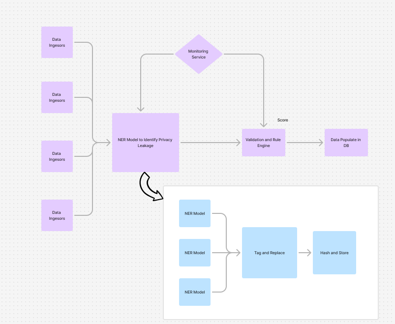

# Assignment 5

## Repository

[Repository](https://github.com/gjyotin305/CSL4030-CourseProject)

## Team Members 

- Jyotin Goel (B22AI063)
- Samay Mehar (B22AI048)

## Current Implementation



- In the current implementation we dockerised each module seperately and we use airflow for container orchestration, to run an example you can run the following code 

Step 1: Pull the image
```bash
docker pull gjyotin305/sample_pipeline_csl4030
```

Step 2: Run the image
```bash
 docker run -itd --name=test-dataingestor-1 --network="host" sample_pipeline_csl4030 /bin/bash     
```

Step 3: Test it out
```bash
docker exec -it test-dataingestor-1 /bin/bash
```

Step4: In the Docker Terminal
```bash
python main.py --url https://en.wikipedia.org/wiki/Alan_Turing
```

- We are using Apache Airflow for container orchestration, we organise it as DAGs to execute it

### ElasticSearch

- We are using ElasticSearch, Kibana for Log monitoring for our implementation

To Try it out

```bash
docker-compose up -d
```

#### Why Elasticsearch is Ideal for Log Monitoring

Elasticsearch, part of the Elastic Stack (ELK: Elasticsearch, Logstash, and Kibana), is a highly popular solution for log monitoring and analysis. Here’s why it stands out as an effective tool for managing and analyzing log data.

#### 1. **Fast Data Ingestion and Search Capabilities**
   - Elasticsearch is built on the Lucene search engine, providing extremely fast indexing and search capabilities, even with large datasets.
   - It can handle a high volume of log data in real-time, which is essential for monitoring and responding to log events as they occur.
   - Full-text search and filter options make it easy to retrieve relevant logs quickly, even in complex queries.

#### 2. **Scalability and Distributed Architecture**
   - Elasticsearch is designed to be horizontally scalable, allowing it to expand with growing log data by adding more nodes to a cluster.
   - The distributed architecture ensures reliability and high availability, as data is stored across multiple nodes, reducing the risk of data loss or downtime.

#### 3. **Powerful Filtering and Aggregation**
   - With Elasticsearch’s rich query language, you can filter, aggregate, and analyze data based on specific fields, time ranges, or custom conditions.
   - This allows you to set up fine-grained monitoring criteria, such as tracking error rates, examining latency spikes, or analyzing system usage patterns.

#### 4. **Easy Integration with Kibana for Visualization**
   - Elasticsearch integrates seamlessly with **Kibana**, providing a graphical interface to visualize and interact with your log data.
   - Kibana dashboards allow users to create charts, graphs, and alerts, making it easier to spot trends, outliers, and anomalies in real-time.

#### 5. **Flexible and Extensible Data Model**
   - Elasticsearch uses a schema-free JSON data structure, making it simple to add new types of log data without complex schema migrations.
   - This flexibility allows logs from different sources (e.g., web servers, applications, network devices) to be centralized and stored in one place for analysis.

#### 6. **Alerting and Automated Monitoring**
   - Elasticsearch supports alerting (through Kibana or ElastAlert), enabling the automatic generation of alerts based on log data patterns.
   - Alerts can notify administrators of critical events, allowing for quick responses to potential issues, improving overall system reliability.

#### 7. **Community and Ecosystem Support**
   - Elasticsearch has a large community and extensive documentation, making it easier to find resources, troubleshoot issues, and implement best practices.
   - Its integration with other Elastic Stack components (like Logstash and Filebeat) and third-party tools makes it adaptable to different architectures and use cases.

#### Conclusion
Elasticsearch’s speed, scalability, flexibility, and integration with visualization tools make it a powerful solution for log monitoring. It provides everything needed to handle high log volumes, search efficiently, analyze data in real time, and respond to critical events, making it ideal for both small and large-scale log monitoring setups.

### Views

Please refer to the github repository for the same.

[Repository](https://github.com/gjyotin305/CSL4030-CourseProject)

### Database

We are using two databases here, mongodb being the intermediate one for fast data transfer, and PostgresSQL for the final populate in main DB.

#### Key PostgreSQL Features

1. **Native JSON and JSONB Support**  
   PostgreSQL supports JSON and JSONB types, allowing efficient storage and querying of semi-structured data. JSONB, in particular, offers fast querying and indexing, ideal for storing multiple data versions as JSON documents. This flexibility makes it easier to adapt data structures and manage versioned records in a single table.

2. **Row-Level Security (RLS)**  
   Row-Level Security in PostgreSQL allows fine-grained control over data access at the row level. It is ideal for multi-tenant applications or cases requiring restricted access to specific data versions. By combining RLS with versioning, PostgreSQL ensures secure management of different data states while maintaining user-specific access permissions.

3. **Declarative Table Partitioning**  
   PostgreSQL’s declarative partitioning enables the division of large tables into smaller, manageable partitions. This is particularly useful for versioned data, as older versions or historical records can be stored in separate partitions. Partitioning optimizes storage and improves query performance for applications with large datasets or frequent data versioning.

4. **Time Travel and History Tracking**  
   Extensions like `pgAudit` and triggers allow for tracking changes and creating history logs. `pgAudit` logs detailed session and object-level activity, while triggers automatically store old versions in history tables on updates or deletes. This supports data auditability, point-in-time recovery, and change tracking for regulatory compliance.

5. **Extensibility with Custom Extensions**  
   PostgreSQL supports a range of extensions, including `pg_partman` for partition management and `temporal_tables` for temporal data management. These extensions allow easy tracking of data over time by adding start and end timestamps, enhancing versioning and historical data tracking capabilities for advanced data management applications.
