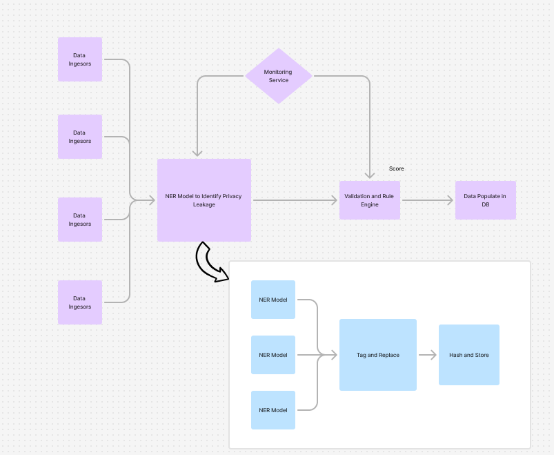

# CSL4030-CourseProject

## Team Members
- Jyotin Goel (B22AI063)
- Samay Mehar (B22AI048)

## Initial Plan 1:

- Use Airflow to orchestrate all containers
- Use Data Ingestors for Scraping Data with some rule based checks
- Then NER model (initially sPacy) to check for tags
- Validation Engine
- Data Populate in PostGresSQL Instance 